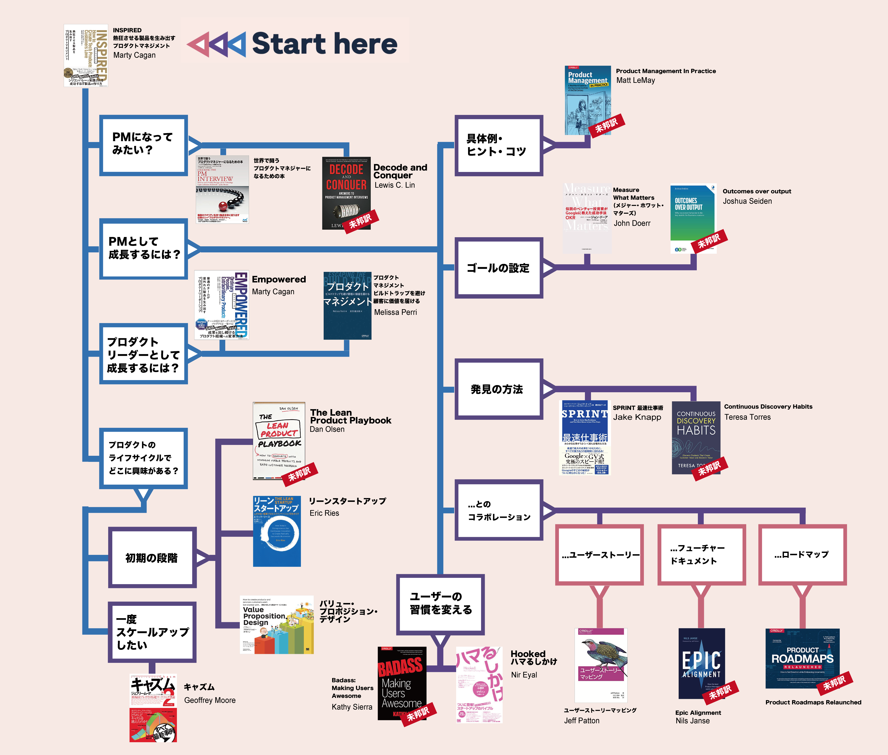

# visual-guide-best-books-PM

# LIST

|title|URL|
----|----
|INSPIRED 熱狂させる製品を生み出すプロダクトマネジメント |https://www.amazon.co.jp/dp/B0814STTHV/|
|世界で闘うプロダクトマネジャーになるための本 ~トップIT企業のPMとして就職する方法|https://www.amazon.co.jp/dp/4839951772/|
|EMPOWERED 普通のチームが並外れた製品を生み出すプロダクトリーダーシップ|https://www.amazon.co.jp/dp/B098B4NLFJ/|
|プロダクトマネジメント ―ビルドトラップを避け顧客に価値を届ける|https://www.oreilly.co.jp//books/9784873119250/|
|リーン・スタートアップ　ムダのない起業プロセスでイノベーションを生みだす|https://www.amazon.co.jp/dp/B00F3UTIQY/|
|バリュー・プロポジション・デザイン 顧客が欲しがる製品やサービスを創る|https://www.amazon.co.jp/dp/B00V9M5R7E/|
|キャズム Ver.2 増補改訂版 新商品をブレイクさせる「超」マーケティング理論|https://www.amazon.co.jp/dp/B00OCGT0HM/|
|Measure What Matters（メジャー・ホワット・マターズ） 伝説のベンチャー投資家がGoogleに教えた成功手法 OKR|https://www.amazon.co.jp/dp/B07JCZVFZ9/|
|SPRINT 最速仕事術――あらゆる仕事がうまくいく最も合理的な方法|https://www.amazon.co.jp/dp/B06Y5NW5PQ/|
|Hooked ハマるしかけ 使われつづけるサービスを生み出す［心理学］×［デザイン］の新ルール|https://www.amazon.co.jp/dp/B00KKN3JAK/|
|ユーザーストーリーマッピング|https://www.oreilly.co.jp//books/9784873117324/|

